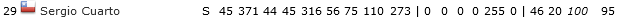
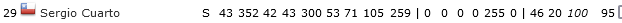

## Co je cílem

V kádru, kde jsou vypsaní všichni hráči, vypočítat a zobrazit "správnou" hodnotu skillů dle aktuální Ec a sehranosti.

Je to věc, kterou ze začátku sezóny pravda člověk moc neužije. Zato v pokročilejší fázi ročníku se může hodit porovnat si, jak na tom hráči skutečně jsou (a nebo možná ne a je to celé jen můj výmysl... :-D).

## Instalace

Následující odkaz buď přetáhněte do lišty záložek v prohlížeči, nebo prostě uložte do záložek.

<a href="javascript:(function(){const e=new URLSearchParams(window.location.search).get('p');if(e&&'tym_kadr'==e){const e=document.querySelector('.content-data');let t,n,r=document.createElement('p'),o=function(){t=parseInt(document.querySelector('#div_sehranost td:nth-child(2)').textContent.slice(10,-2)),n=40*t/100/100+1},l=function(){let e=document.querySelectorAll('[id^=div_kategorie_id] > table > tbody > tr');o(),e.forEach((function(e){let t=e.classList.contains('bgcolor-orange'),r=parseInt(e.querySelector('td:nth-child(22)').innerHTML)/100,o=e.querySelectorAll('td');for(let e=3;e<12;e++){o[e].querySelector('span')&&o[e].removeChild(o[e].querySelector('span'));let l=document.createElement('span');l.style.position='absolute',l.style.left='0',l.style.width='100%',l.style.textAlign='right',l.style.color='#000',l.innerHTML=t?Math.round(parseInt(o[e].innerHTML)*r*n):Math.round(parseInt(o[e].innerHTML)*r),o[e].style.position='relative',o[e].style.color='transparent',o[e].appendChild(l)}}))};r.style.textAlign='left',r.style.marginBottom='1rem',r.innerHTML='✔️ Hodnota skillů upravená podle aktuální EC, u základní jedenáctky zohledněna také sehranost.',e.prepend(r),e.addEventListener('change',(function(e){'checkbox'!=e.target.getAttribute('type')&&'select'!=e.target.getAttribute('type')||setInterval((function(){l()}),500)})),l()}})()">Odkaz do záložek</a>

V různých prohlížečích se bude postup pro uložení záložky lišit.

Pokud máte zapnutou lištu záložek, stačí výše uvedený odkaz vzít myší a přetáhnout na lištu. Zobrazí se tam jako nová záložka.

Postup pro tři obvyklé prohlížeče popisuji dále. Je potřeba ještě zmínit, že postupy pro mobilní, potažmo tabletové verze prohlížečů budou jiné a tento můj nástoj tam zatím ani nemusí fungovat. Proto prosím zkoušejte jen na počítačích / noteboocích.

### Mozilla Firefox

Kdo používáte Firefox, můžete také kliknout na odkaz pravým tlačítkem a zvolit **Přidat do záložek**.

### Google Chrome

V Chromu po kliknutí pravým tlačítkem na odkaz zvolte **Kopírovat adresu odkazu**. Poté si otevřete **Správce záložek** (klávesová zkratka Ctrl + Shift + O), v pravém horním rohu klikněte na tři tečky a zvolte **Přidat novou záložku**. Pak už stačí jen vyplnit název (libovolný) a do řádku _Adresa URL_ vložit odkaz, který jste na začátku zkopírovali do schránky.

### Microsoft Edge

Pro Edge platí podobný postup, jako pro Chrome. Také musíte odkaz nejprve zkopírovat do schránky. Nahoře pak kliknete na **Oblíbené**, pod třemi čárkami se skrývá volba **Otevřít stránku Oblíbené**. Pak už jen zvolíte možnost **Přidat oblíbenou položku** a dokončíte stejně jako v Google Chrome.

## Jak použít

1. otevřu si Kádr (pod záložkou A-tým, prostě klasika)
2. zatímco jsem v Kádru, kliknu na záložku, kterou jsem si uložil dříve
3. pod nadpisem "Můj tým - Kádr" by měla přibýt věta: ✔️ Hodnota skillů upravená podle aktuální EC, u základní jedenáctky zohledněna také sehranost.
4. skilly všech hráčů by nyní měly být přepočítané podle Ec, u základní jedenáctky ještě podle sehranosti

## Příklad

Mám hráče Sergio Cuarto. Sezónu teď díky věku začíná s Ec 95. V kádru tedy normálně vidím toto:

Teď kliknu na uloženou záložku s mým nástrojem. Sergio Cuarto má Ec 95, čili reálně např. jeho hodnota obrany není 371, ale 95% z 371, tedy zhruba 352.

A tento přepočet je proveden pro všechny atributy s výjimkou doplňkových, na které nemá Ec vliv.
